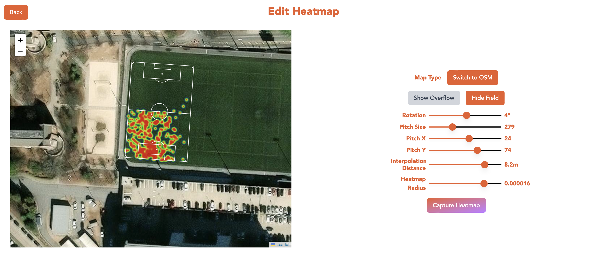

# JogaFlo ⚽🔥🗺️

**Convert your Strava activities into professional football heatmaps**

[jogaflo.joshforden.com](https://jogaflo.joshforden.com)

## About

JogaFlo is a web application that transforms your Strava tracking data into professional-style football heatmaps, similar to those used in professional soccer match analysis. 




## Tech Stack 💻

- **Frontend**: Next.js, React, TypeScript
- **Styling**: Tailwind CSS
- **Database**: MongoDB Atlas with Prisma ORM
- **Authentication**: NextAuth.js with Strava OAuth (session, not JWT)
- **Visualization**: heatmap.js
- **Deployment**: Vercel

## Getting Started

### Prerequisites

- Node.js 18+ 
- npm, yarn, or pnpm
- MongoDB database
- Strava API credentials

### Local Installation

1. **Clone the repository**
   
2. **Install dependencies**
   ```bash
   npm install
   # or
   yarn install
   # or
   pnpm install
   ```

3. **Set up environment variables**
   Create a `.env.local` file in the root directory:
   ```env
   # Database
   DATABASE_URL="your-mongodb-connection-string"
   
   # NextAuth
   NEXTAUTH_SECRET="your-nextauth-secret"
   NEXTAUTH_URL="http://localhost:3000"
   
   # Strava OAuth
   STRAVA_CLIENT_ID="your-strava-client-id"
   STRAVA_CLIENT_SECRET="your-strava-client-secret"
   ```

4. **Set up the database**
   ```bash
   npx prisma generate
   npx prisma db push
   ```

5. **Run the development server**
   ```bash
   npm run dev
   # or
   yarn dev
   # or
   pnpm dev
   ```

6. **Open your browser**
   Navigate to [http://localhost:3000](http://localhost:3000)

## Usage

1. **Connect your Strava account** - Sign In with your Strava account to authorize JogaFlo to access your activities
2. **Select an activity** - Choose from your recent Strava activities
3. **Edit heatmap** - configure the map tile style, field lines overlay position, and heatmap parameters

## API Routes

- `POST /api/auth/[...nextauth]` - NextAuth.js authentication endpoints
- `GET /api/activities` - Fetch user's Strava activities
- `POST /api/heatmap` - Fetch activity's raw tracking data

## Support

This project served as a learning experience in full stack web development for me. If you have any comments, questions, or concerns, please reach out. I am always looking for feedback. 🧡